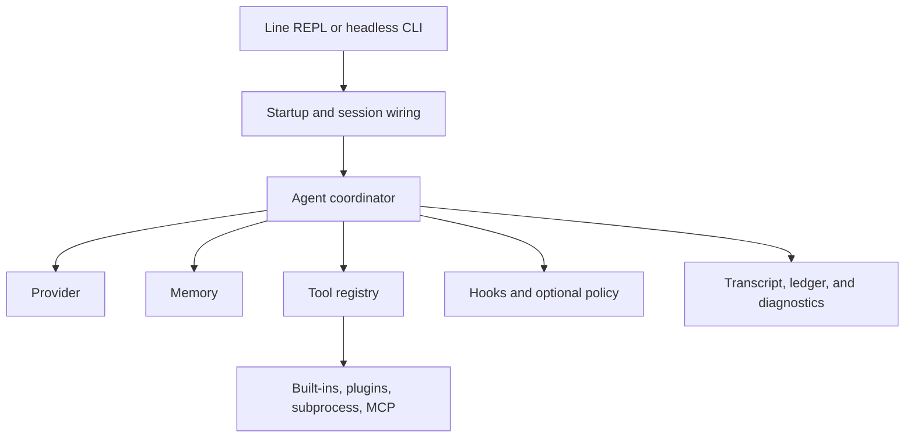
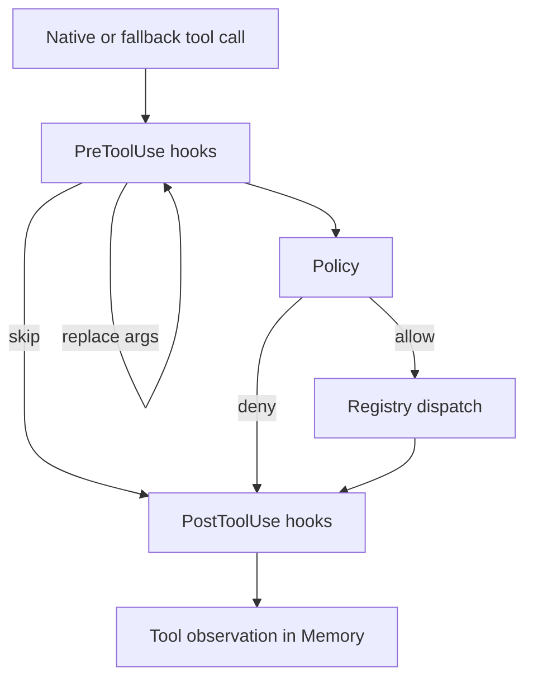

# Current architecture

Oli is a text-first coding-agent runtime exposed as both a binary and a Rust
library. This document describes the code that exists now. Product rationale
and historical plans live under [`specs/`](../specs/README.md).

## System at a glance



[`src/bin/oli.rs`](../src/bin/oli.rs) parses commands and assembles a run.
[`src/bootstrap.rs`](../src/bootstrap.rs) provides reusable constructors for
tools, sessions, memory, accounting, and subagents. [`Agent`](../src/agent/mod.rs)
owns conversation state and coordinates the think → call → observe loop.

The current line and headless frontends share `Agent` and bootstrap helpers, but
there is not yet a frontend-neutral session controller. The architecture polish
work will introduce a command/event/snapshot boundary so a TUI or desktop
frontend does not need to copy REPL behavior.

## Runtime lifecycle

For each submitted prompt, [`Agent::run_streaming`](../src/agent/mod.rs):

1. Records the user message in `Memory`.
2. Refreshes tools for MCP servers that emitted `tools/list_changed`.
3. Materializes the pinned and recent context plus tool schemas.
4. Estimates the next request and asks memory to compact while over budget.
5. Sends a `ChatRequest` through the active `Provider`.
6. Streams provider events to the caller and records usage and latency.
7. Records the assistant message and parses fallback textual tool calls when
   the selected model does not support native calls.
8. If tools were requested, executes them and records observations, then starts
   another model turn.
9. Otherwise dispatches stop hooks and returns `RunOutcome::Completed`.

`max_turns` produces the distinct `RunOutcome::MaxTurnsExhausted` state. It
cannot be converted into a successful completion by presentation code.

## Module map

| Path | Responsibility |
| --- | --- |
| `src/agent/` | Agent coordinator, typed outcomes, tool execution, model capabilities, system context, fallback parsing, and memory strategies. |
| `src/providers/` | `Provider` implementations for Anthropic, ChatGPT subscription, and OpenAI-compatible APIs. |
| `src/tools/` | `Tool`, registry, built-in tools, subprocess tools, output bounds, and subagent support. |
| `src/hooks/` | Pre-tool, post-tool, and stop hook composition. |
| `src/policy/` | Optional deterministic hard-deny policy. Normal runs use `AllowAll`; `--strict` uses `DenyAll`. |
| `src/mcp/` | stdio and streamable-HTTP MCP clients, OAuth, server lifecycle, and MCP-to-Tool adapters. |
| `src/plugins/` | Sandboxed Lua discovery, loading, host APIs, tools, hooks, and slash commands. |
| `src/repl/` | Rustyline frontend and stream rendering; `repl/slash/` contains the slash registry and responsibility-grouped built-in commands. |
| `src/bootstrap.rs` | Reusable startup constructors for tools, sessions, memory, ledger, and subagents. |
| `src/bin/oli.rs` | Clap entrypoint and top-level command dispatch. |
| `src/config.rs` | Global/project TOML loading and deterministic overlay rules. |
| `src/ledger/` | Request estimates, context attribution, usage, cost, and latency records. |
| `src/auth/` | ChatGPT subscription OAuth and credential refresh. |
| `src/notes/` | Cross-session filesystem note store. |
| `src/diagnostics.rs` | Bounded operational warning ring buffer. |
| `src/replay.rs` | Provider-free transcript replay and comparison. |

## Core extension surfaces

| Surface | Purpose | Bundled implementations / registration |
| --- | --- | --- |
| `Provider` | Turn messages and tool schemas into streamed assistant responses. | `providers/anthropic.rs`, `providers/openai_compat.rs`, and the test fake; add construction in `providers::build`. |
| `Tool` | Describe and execute a model-callable capability. | Built-ins under `tools/`; register top-level tools in binary startup or reusable defaults in `bootstrap::build_default_tools`. |
| `Memory` | Own active conversation context and compaction. | `LinearWithCompact`, `PersistedMemory`, and `EmbeddingRagMemory` under `agent/memory/`. |
| `Hook` | Observe, replace, or skip lifecycle values. | Built-in and Lua hooks share `HookRegistry`. |
| `Policy` | Deterministically allow or hard-deny a model tool call. | `AllowAll` and `DenyAll`; embedders can provide another implementation with `Agent::with_policy`. |
| `SlashCommand` | Handle line-frontend commands without sending them to a model. | `SlashRegistry` lives in `repl/slash/registry.rs`; bundled implementations are grouped by responsibility beside it. |
| `SubagentSpawner` | Construct isolated child loops for the `Task` tool. | `DefaultAgentSpawner` in `bootstrap.rs`. |
| `McpHandle` | Retain a live MCP server and refresh its tools. | Built by `mcp::connect_all`; exposed tools enter the normal registry. |

The public re-exports in [`src/lib.rs`](../src/lib.rs) are the supported starting
point for embedders.

## Tool execution



Normal runs never pause for per-call permission. Hooks can replace arguments or
short-circuit a call with a synthetic result. The optional policy can only allow
or deny; `--strict` installs deny-all. Post hooks see real, skipped, and denied
results before the observation is recorded.

Tools use `ToolContext` for the current working directory, bounded full-result
cache, and the read set that protects edits from stale external changes.
Oversized results carry a cache identifier that the `ShowFull` tool can page.

Plugin host calls are different from model tool calls: plugins are
user-installed code and their explicit `ctx:*` calls dispatch directly through
the registry. Lua has no raw `os`, `io`, or dynamic-library access.

## Memory and persistence

The system prompt is pinned once with `Agent::pin_system_prompt`; clearing or
compacting recent memory does not remove it. `Memory::snapshot_parts` keeps
pinned, compacted, recent, and tool-schema attribution separate for accounting.

Top-level runs wrap memory in `PersistedMemory`. Session transcripts are JSONL,
and replay restores both conversation messages and the read set needed by the
edit safety invariant. Compaction replaces older active context with a summary
transactionally; failures retain the unchanged request context.

The main persisted locations are:

- global config: `$XDG_CONFIG_HOME/oli/config.toml`, normally
  `~/.config/oli/config.toml`;
- project config: the nearest ancestor `.oli/config.toml`;
- sessions and adjacent `*.ledger.jsonl` files: the runtime sessions directory;
- notes: the filesystem notes directory;
- plugins: global and project plugin directories;
- MCP OAuth credentials: the owner-only MCP auth directory.

Use `/paths` instead of guessing resolved locations. See
[`docs/cheatsheet.md`](cheatsheet.md) for commands, files, and environment
variables.

## Configuration and startup

`Config` starts from environment defaults, merges global TOML, then merges the
nearest project overlay. Tables merge by key, scalar leaves are replaced, and
project array entries precede global entries where lookup order matters.

The binary then:

1. resolves provider and model overrides;
2. opens notes, plugins, MCP servers, transcript, and ledger;
3. builds the default registry and registers `Task`, plugin, and MCP tools;
4. constructs and pins the agent;
5. hands it to the headless command path or line REPL.

MCP connection failures and plugin load failures are reported through
diagnostics without preventing unrelated capabilities from starting.

## Observability

- `/diagnostics` shows operational warnings from plugins, MCP, providers, and
  other recoverable startup/runtime failures.
- `/cost` shows last-call and session token/cost totals.
- `/memory` explains active context pressure and memory composition.
- Ledger JSONL records estimates, attributed context, provider usage,
  compaction, latency, and configured pricing per request.
- Transcript JSONL is the durable conversation and replay source.
- `oli replay` compares stable fixtures without making provider calls.

## Frontend boundary

Today, `repl::run` owns rustyline input and consumes provider `StreamEvent`
values directly. Headless mode separately shapes text or JSON output in the
binary. Both reuse `Agent`, but cancellation, commands, snapshots, and
presentation are not yet one library contract.

The target boundary is deliberately smaller than a `Ui` trait:

```text
frontend commands → session controller → Agent
Agent/runtime events → frontend
session snapshot → frontend
```

Owned events must be safe to send over a channel or process bridge. Snapshots
must expose session id, active provider/model, tools, MCP health, usage/cost,
and run state without parsing terminal output. Frontends own widgets, windows,
key bindings, and rendering. Core runtime modules must not read stdin or depend
on a UI framework.

A future review mechanism belongs at this boundary as a typed run checkpoint:
the runtime stops and returns control. It is not a per-tool approval prompt.

## Extension paths

- Native tool: implement `Tool` in `src/tools/` and register it in startup.
- Provider: implement `Provider` and add it to `providers::build`.
- Slash command: implement `SlashCommand` and register it in the default set.
- Lua plugin: add one file to a plugin discovery directory.
- Subprocess tool: add `[[tools.subprocess]]` configuration.
- MCP server: use `oli mcp add` for OAuth HTTP servers or add stdio/header
  configuration under `[mcp.servers.<name>]`.
- Frontend: wait for or contribute the session command/event/snapshot boundary;
  do not fork the agent loop into presentation code.

## Intentional boundaries

- Oli currently ships no TUI, desktop, IDE, hosted, or multi-user frontend.
- The core remains text-independent even though the bundled binary is
  text-first.
- Tools execute automatically; deterministic policy denial and hooks are the
  available interception mechanisms.
- New abstractions should follow demonstrated consumers rather than speculative
  framework design.

For modification conventions and exact test commands, read
[`AGENTS.md`](../AGENTS.md). For the active structural plan, read
[`specs/architecture-polish-plan.md`](../specs/architecture-polish-plan.md).
